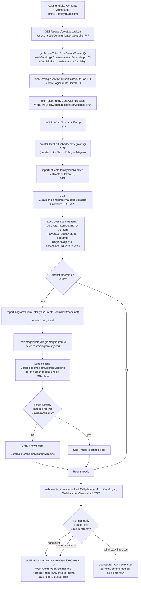
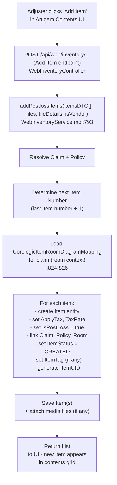
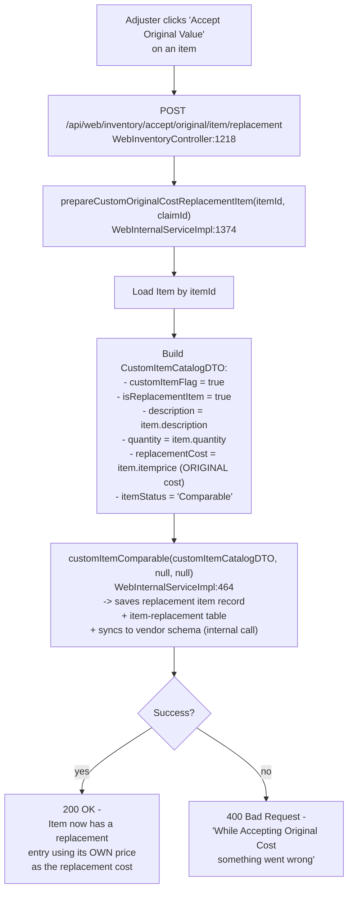

# Demo Flow: Import Items, Add Item & Accept Original Value

This document maps the three features for today's demo to actual backend code.

---

## 1. Import Items (Launch from Cotality / Streamline)

When the adjuster opens the Artigem "Contents" plugin from inside Cotality/Symbility, the embedded
launch automatically pulls the estimate items, builds the rooms (from diagrams), and creates the
items in Artigem.

**Talking points (keep it high-level):**
- Trigger: opening the Artigem plugin from within Cotality automatically calls our `/token` endpoint.
- We exchange tokens, identify/create the claim, then call `importEstimateItems()`.
- That method calls Symbility's Estimate API to get the line items (`EstimateItems[]`).
- Each item carries a `DiagramID` + `DiagramObjectID` — Symbility's way of saying "this item belongs to this room on this floor plan."
- Before creating items, we make sure the **Rooms** exist in Artigem (`importDiagramsFromCotalityAndCreateRoomsInStreamline`), using `CorelogicItemRoomDiagramMapping` as the bridge table so we never create the same room twice.
- Finally `addOrUpdateItemFromCoreLogic()` decides: brand-new import → create items via `addPostlossItems()`; already imported → (currently a no-op, update logic is commented out — this is part of "Update Estimate" which Gaurav covers tomorrow).

---

## 2. Add Item (Manual, from Artigem UI)

**Talking points:**
- Same `addPostlossItems()` method is the workhorse for both the Cotality import AND manual "Add Item" — the difference is just *who* calls it and what's pre-filled.
- When added manually, the adjuster fills in description/category/etc. via the UI; when imported from Cotality, those fields come pre-populated from `EstimateItems[]`.
- Each new item gets a unique `ItemUID`, an auto-status of `CREATED`, and is linked to the claim/policy/room.

---

## 3. Accept Original Value (Item Replacement)

This feature lets the adjuster say: "the price Cotality/the system suggested for replacement is fine — just use the item's original cost as the replacement cost," without going through the full vendor/catalog comparison flow.

**Talking points:**
- "Accept Original Value" = treat the item's **own current price** (`item.getItemprice()`) as its replacement cost — no need to search a catalog or vendor for a comparable item.
- It builds a `CustomItemCatalogDTO` marked `isReplacementItem = true`, `itemStatus = "Comparable"`, with `replacementCost` set to the item's existing price.
- `customItemComparable()` then persists this as the item's replacement record and pushes it to the vendor schema via an internal call — so downstream (estimate/RCV-ACV calculations) treat this item as "resolved" without further vendor lookup.

---

## Quick Reference — File:Line

| Feature | Entry Point | Key Method |
|---|---|---|
| Import Items (launch) | `WebCorelogicCommunicationController.java:747` (`/token`) | `importEstimateItems()` — `WebCoreLogicCommunicationServiceImpl.java:3433` |
| Room/Diagram sync | (called from above) | `importDiagramsFromCotalityAndCreateRoomsInStreamline()` — `:3989` |
| Item creation/sync | (called from above) | `addOrUpdateItemFromCoreLogic()` — `WebInventoryServiceImpl.java:6797` |
| Add Item (manual) | `WebInventoryController` (Add Item endpoint) | `addPostlossItems()` — `WebInventoryServiceImpl.java:793` |
| Accept Original Value | `WebInventoryController.java:1218` (`/accept/original/item/replacement`) | `prepareCustomOriginalCostReplacementItem()` — `WebInternalServiceImpl.java:1374` |
